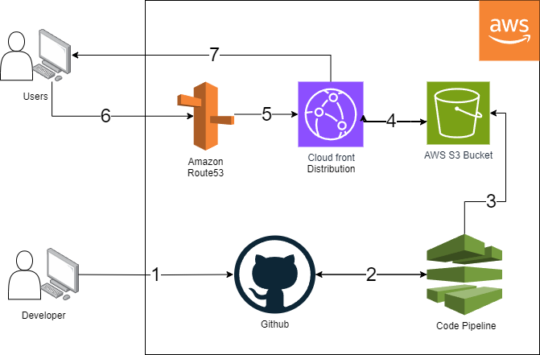

# Source Code for YuonFlemming.com
This repo is the source code for my personal website. I originally sttarted it to study and practice web development, and recently its grown to a larger side project in mananging AWS services for webhosting. Visit yuonflemming.com to see the final results

# Overview
The serverless architecture that supports the site will be described in detail below. The site code is hosted in an AWS S3 bucket. The bucket is made publicly accessible, and the bucket endpoint is connected to a Cloudfront Distribution. Requests to the url yuonflemming.com are routed to the Cloudfront Distribution using AWS Route53. The Cloudfront Distribution hosts a version of the web content that is cached to make it more quickly accessible to users. Because of this, the version of the website delivered to requests may be an older version that has not been updated in the Cloudfront Distribution cache.

On the back end, in order to continuously deliver updates when changes are released, a Codestar Pipeline updates the content of the S3 bucket with the files host on the main branch of this git repository. The pipeline is triggered to launch when there is a commit to the main branch. 

## Architecture Diagram

1. A developer pushes their work to github.

2. In Github, when changes are merged in the branch "main", an AWS Codepipeline job is triggered.

3. Codebuild pulls the most recent commit from the "main" branch, and places those files in S3.

4. A cloudfront distribution is configured to point to the S3 bucket where the website code lives. When updates are made to the contents of S3, Cloudfront (within 24 hrs.) begins to serve visitors the newly published website content. Invalidations can also be used to clear the cloudfront cache immediately to serve new content more quickly.

5. In Route53, after buying any relevant domain names, a DNS record is created that will map requests to the configured domain name to the cloudfront distribution. 

6. Users will visit the relevant domain name, in this case yuonflemming.com. Route53 contains the DNS record that will resolve said user requests. 

7. The Route53 DNS record maps the domain name to the cloudfront distribution that has cached the website code from S3. This content is sent to the user.